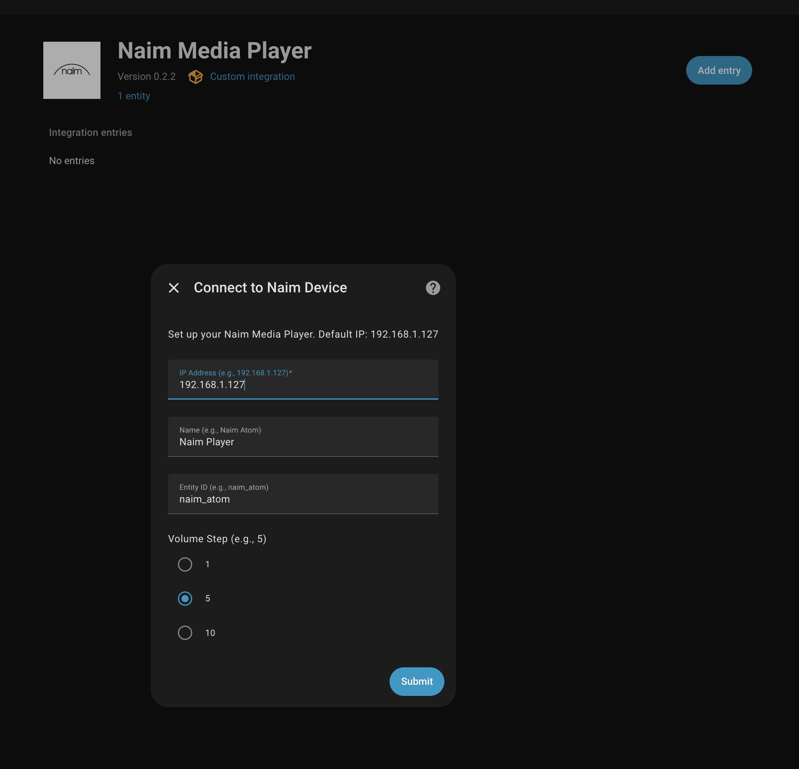
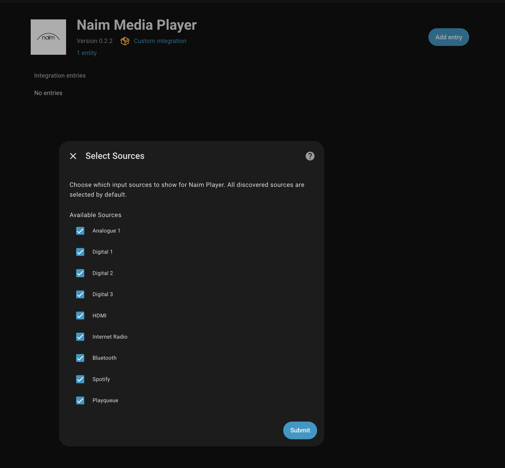
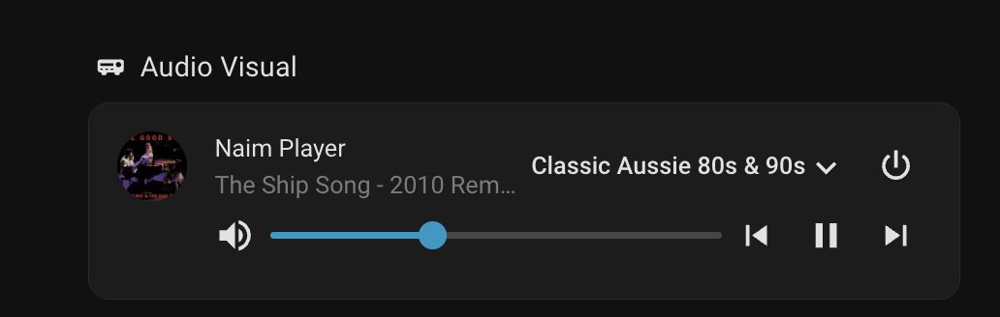
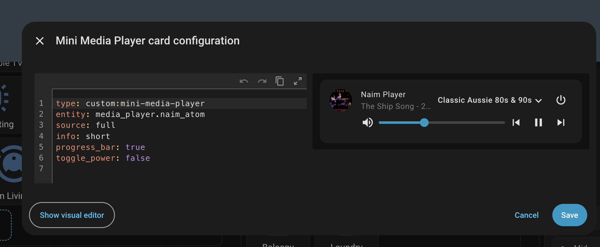

# Naim Media Player - Home Assistant Integration

A Home Assistant custom component to control Naim audio devices (like the Naim Atom) over your local network. This
integration provides full control of your Naim device including playback, volume, source selection, and real-time status
updates via WebSocket connection.

## Features

### Playback Controls

- 🎵 Full playback controls (play, pause, next/previous track)
- ⏱️ Media position and duration tracking
- 🔊 Volume control with 5% increments
- 🔇 Mute functionality

### Source Management

- 📻 Dynamic source discovery from your device
- ✅ Choose which sources appear in Home Assistant
- ⚙️ Reconfigure sources anytime via integration options

### Media Information

- 🖼️ Album art display
- 🏷️ Rich metadata display:
  - Track title
  - Artist name
  - Album name
  - Duration
  - Current position

### Connectivity

- 📊 Real-time status updates via WebSocket
- 🔌 Local network control (no cloud dependency)

## Installation

### Method 1: HACS (Recommended)

1. Open HACS in Home Assistant
2. Click on "Custom Repositories"
3. Add this repository URL with category "Integration"
4. Click "Install"

### Method 2: Manual Installation

1. Copy the `custom_components/naim_media_player` directory to your Home Assistant's `custom_components` directory
2. Restart Home Assistant

## Configuration

This integration uses Home Assistant's UI-based configuration flow. No YAML configuration is required.

### Setup Steps

1. Go to **Settings** → **Devices & Services**
2. Click the **+ ADD INTEGRATION** button
3. Search for "Naim Media Player"
4. Enter your device's IP address and customize settings:



5. Click **Submit** - the integration will verify connectivity to your device
6. Select which input sources you want to appear in Home Assistant:  
   The integration will read from your Naim device via `http://192.168.1.127:15081/inputs`



### Reconfiguring Sources

To change which sources are visible after initial setup:

1. Go to **Settings** → **Devices & Services**
2. Find the Naim Media Player integration
3. Click **Configure**
4. Select or deselect sources as needed

## Supported Devices

### Fully Tested

- Naim Atom

### Should Work (Untested)

- Naim Streamers that have http api support

Please report your experience with other Naim devices to help expand this list.

## Example UI

The media player entity works with any Home Assistant media player card. Here's an example using the popular
[Mini Media Player](https://github.com/kalkih/mini-media-player) card:



### Mini Media Player Card Configuration

```yaml
type: custom:mini-media-player
entity: media_player.naim_atom
source: full
info: short
progress_bar: true
toggle_power: false
```



## Changelog

### v0.3.0

- **Dynamic Source Discovery**: Sources are now automatically detected from your Naim device during setup
- **Source Selection**: Choose which input sources appear in Home Assistant
- **Options Flow**: Reconfigure sources anytime without removing the integration
- **Includes all v0.2.2 fixes**

### v0.2.2

- **Improved Offline Handling**: Entity shows as "Unavailable" when device is offline instead of spamming error logs
- **Reduced Log Noise**: Connection failures now log at DEBUG level instead of ERROR
- **HTTP Timeout**: Added 5-second timeout to HTTP requests to prevent long hangs during polling

### v0.2.0

- **Real-time WebSocket Updates**: Live status updates without polling delays
- **Improved Volume Control**: Debounce mechanism prevents UI feedback loops
- **Enhanced Reliability**: Robust HTTP API client with better error handling
- **New Sources**: Added Roon and HDMI support

### v0.1.1

- **UI Configuration**: Full config flow support for setup via Home Assistant UI
- **Documentation**: Improved setup instructions

### v0.1.0

- Initial release

## Debugging

If you're experiencing issues, add the following to your `configuration.yaml`:

```yaml
logger:
  default: info
  logs:
    custom_components.naim_media_player: debug
```
