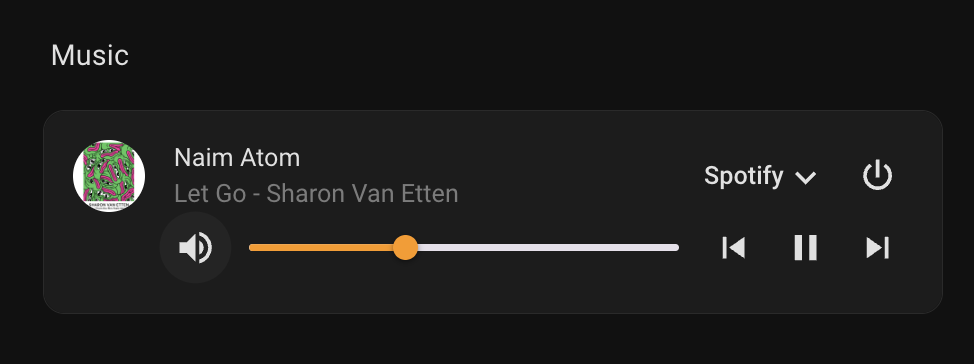

# Naim Media Player - Home Assistant Integration

A Home Assistant custom component to control Naim audio devices (like the Naim Atom) over your local network. This integration provides full control of your Naim device including playback, volume, source selection, and real-time status updates via WebSocket connection.

## Features

### Playback Controls

- 🎵 Full playback controls (play, pause, next/previous track)
- ⏱️ Media position and duration tracking
- 🔊 Volume control with 5% increments
- 🔇 Mute functionality

### Source Management

- 📻 Source selection:
  - Analog 1
  - Digital 1-3
  - HDMI
  - Bluetooth
  - Web Radio
  - Spotify
  - Roon

### Media Information

- 🖼️ Album art display
- 🏷️ Rich metadata display:
  - Track title
  - Artist name
  - Album name
  - Duration
  - Current position

### Connectivity

- 📊 Real-time status updates via WebSocket
- 🔌 Local network control (no cloud dependency)

## Installation

### Method 1: HACS (Recommended)

1. Open HACS in Home Assistant
2. Click on "Custom Repositories"
3. Add this repository URL with category "Integration"
4. Click "Install"

### Method 2: Manual Installation

1. Copy the `custom_components/naim_media_player` directory to your Home Assistant's `custom_components` directory
2. Restart Home Assistant

## Configuration

This integration uses Home Assistant's UI-based configuration flow. No YAML configuration is required.

### Setup Steps

1. Go to **Settings** → **Devices & Services**
2. Click the **+ ADD INTEGRATION** button
3. Search for "Naim Media Player"
4. Enter your device's IP address
5. Optionally customize the name and entity ID
6. Click **Submit** - the integration will verify connectivity to your device

## Supported Devices

### Fully Tested

- Naim Atom

### Should Work (Untested)

- Naim Streamers that have http api support

Please report your experience with other Naim devices to help expand this list.

## Available Sources

- Analog 1
- Digital 1
- Digital 2
- Digital 3
- HDMI
- Bluetooth
- Web Radio
- Spotify
- Roon

## Example UI



## Changelog

### v0.2.0
- **Real-time WebSocket Updates**: Live status updates without polling delays
- **Improved Volume Control**: Debounce mechanism prevents UI feedback loops
- **Enhanced Reliability**: Robust HTTP API client with better error handling
- **New Sources**: Added Roon and HDMI support

### v0.1.1
- **UI Configuration**: Full config flow support for setup via Home Assistant UI
- **Documentation**: Improved setup instructions

### v0.1.0
- Initial release

## Debugging

If you're experiencing issues, add the following to your `configuration.yaml`:

```yaml
logger:
  default: info
  logs:
    custom_components.naim_media_player: debug
```
